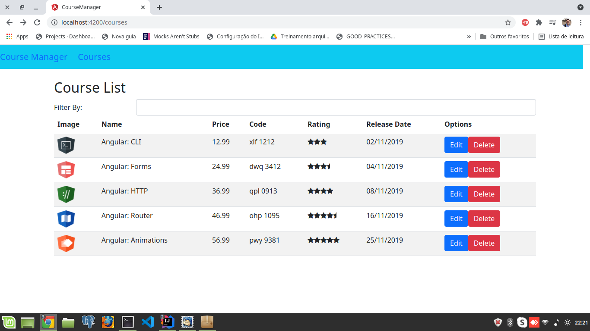

# Introdução Angular 8

Projeto desenvolvido durante a aula do Bootcamp Santander.

## Projeto é uma listagem de cursos
Para rodar o projeto é so rodar o comando **ng serve** e ter o projeto https://github.com/MauroAlbrecht/node-server-angular-8-mock iniciado também.

- Tela do projeto rodando

